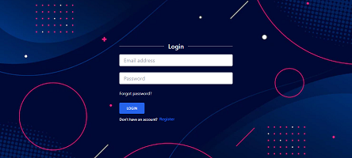
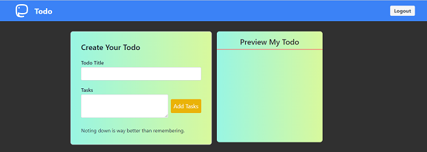

# Full Stack Todo App with Login Authentication

## 🛠 Technologies Used

### Backend

- Express
- Mongodb
- Mongoose
- Some NPM libraries like
  - jsonwebtoken
  - bcrypt
  - cookieparser
  - cors

### Frontend

- React
- Tailwind CSS
- Axios
- Routes
- Moment

## Snaps of project

## Author-Contact

- [Ajinkya-Github](https://github.com/AjinkyaVeer007)

- [Ajinkya-LinkedIn](https://www.linkedin.com/in/ajinkya-veer-0ba100238/)

- [Ajinkya-Findcoder](https://www.findcoder.io/u/ajinkya_veer)
